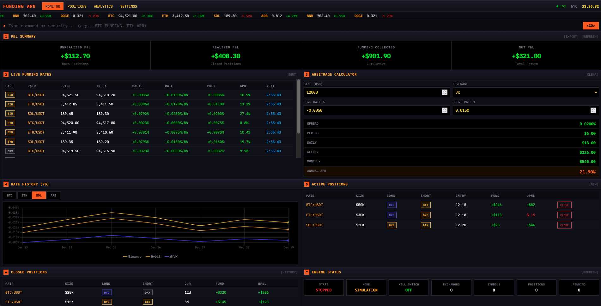

# Funding Rate Arbitrage

A fully autonomous trading system for capturing funding rate arbitrage opportunities across cryptocurrency perpetual futures exchanges. Features a Bloomberg Terminal-inspired dashboard for professional traders.



## Strategy

**Core concept**: Open SHORT positions on exchanges with higher funding rates and LONG positions on exchanges with lower funding rates for the same asset, collecting the spread at each 8-hour funding interval.

## Features

- **Multi-Exchange Support** - Binance and Bybit perpetual futures via ccxt
- **Real-time Monitoring** - WebSocket-based funding rate updates
- **Automated Execution** - Event-driven opportunity detection and order execution
- **Risk Management** - Circuit breakers, kill switch, liquidation handling
- **Bloomberg-Style Dashboard** - Professional trading interface
- **Telegram Alerts** - Real-time notifications for trades and critical events
- **Simulation Mode** - Test strategies on exchange testnets before going live

## Quick Start

### Prerequisites

- Python 3.10+
- Exchange API keys (Binance, Bybit)

### Installation

```bash
# Clone the repository
git clone https://github.com/yourusername/fundingarb.git
cd fundingarb

# Create virtual environment
python -m venv .venv
source .venv/bin/activate

# Install dependencies
pip install -r requirements.txt
```

### Configuration

```bash
# Copy example config
cp config/config.example.yaml config/config.yaml

# Edit with your API keys and settings
vim config/config.yaml
```

### Run

```bash
# Start the backend server
python -m backend.main

# Or with uvicorn for development
uvicorn backend.api.server:app --reload --port 8000
```

Open `dashboard/index.html` in your browser or serve it via the backend.

## Configuration

```yaml
exchanges:
  binance:
    api_key: "your_api_key"
    api_secret: "your_api_secret"
    testnet: true  # Start with testnet!
  bybit:
    api_key: "your_api_key"
    api_secret: "your_api_secret"
    testnet: true

trading:
  symbols:
    - "BTC/USDT:USDT"
    - "ETH/USDT:USDT"
  min_spread_percent: 0.01
  max_position_usd: 10000
  leverage: 5

alerts:
  telegram:
    enabled: true
    bot_token: "your_bot_token"
    chat_id: "your_chat_id"
```

## API Endpoints

| Method | Endpoint | Description |
|--------|----------|-------------|
| GET | `/api/health` | Health check |
| GET | `/api/status` | Engine status |
| GET | `/api/funding-rates` | Live funding rates |
| GET | `/api/positions` | List positions |
| POST | `/api/positions/open` | Open hedged position |
| POST | `/api/positions/{id}/close` | Close position |
| POST | `/api/engine/start` | Start automation |
| POST | `/api/engine/stop` | Stop automation |
| POST | `/api/engine/kill` | Emergency kill switch |

## Project Structure

```
fundingarb/
├── backend/
│   ├── api/          # FastAPI server and routes
│   ├── engine/       # Trading engine (scanner, detector, executor)
│   ├── exchanges/    # Exchange adapters (Binance, Bybit)
│   ├── database/     # SQLAlchemy models and repository
│   ├── alerts/       # Telegram notifications
│   └── config/       # Configuration loading
├── dashboard/        # Bloomberg-style web UI
├── config/           # Configuration files
├── tests/            # Unit and integration tests
└── docker/           # Docker deployment
```

## Testing

```bash
# Run all tests
python -m pytest tests/ -v --tb=short

# Run specific test file
python -m pytest tests/unit/test_detector.py -v
```

## Security Notes

- Never enable withdrawal permissions on API keys
- Always start with testnet mode (`testnet: true`)
- Use encrypted config for production (see `scripts/encrypt_config.py`)
- Run simulation for at least 24 hours before live trading

## Disclaimer

This software is for educational purposes only. Trading cryptocurrency derivatives involves significant risk. Past performance does not guarantee future results. Use at your own risk.

## License

MIT
